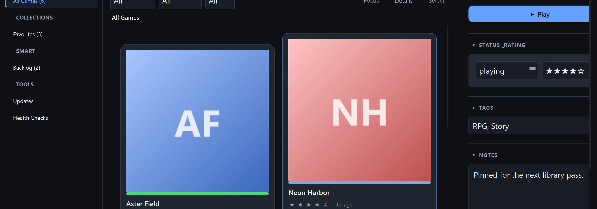

# Game Library Manager

A Windows desktop app for keeping a large shortcut-based game library tidy, searchable, and launch-ready.

Game Library Manager is for collections that already live as Windows shortcuts, web launchers, and downloaded builds. Point it at a shortcut folder, scan once, then manage the library from a local PySide6 app instead of a spreadsheet.



_Screenshot uses sample data._

## What It Handles

| Area | What it does |
| --- | --- |
| Library | Card grid, list mode, tags, status filters, collections, ratings, notes, and launch counts. |
| Scanning | Imports top-level `.lnk`, `.url`, and `.html` entries while preserving edits you already made. |
| Updates | Checks source pages in the background and keeps update states separate from unknown results. |
| Maintenance | Flags missing shortcuts, targets, source URLs, archive paths, game folders, and version mismatches. |
| Customization | Themes, density options, font controls, focus mode, and saved layout preferences. |
| Tools | Bundled shortcut scanner, bulk source URL import, archive import, export/import, undo/redo, and keyboard shortcuts. |

## Tech Stack

- Python 3.11+
- PySide6 for the desktop UI
- pywin32 for Windows shortcut resolution
- lxml for source-page parsing
- pytest and pytest-cov for the test suite
- GitHub Actions for Linux tests, lint checks, and a Windows smoke test
- PyInstaller packaging notes for Windows builds

## Getting Started

Game Library Manager is Windows-first. Tests can run elsewhere, but `.lnk` resolution uses Windows shell APIs.

```powershell
git clone https://github.com/erichuang1425/Game-Library-Manager.git
cd Game-Library-Manager
python -m venv .venv
.venv\Scripts\activate
python -m pip install --upgrade pip
pip install -r requirements.txt
python src/main.py
```

First run:

1. Choose **Scan** and select the folder that contains your shortcuts.
2. Review duplicate shortcut groups before importing.
3. Select a game and add source URL, installed version, notes, tags, and archive paths in **Details**.
4. Use **Check Updates** to refresh version status.
5. Open **Health Checks** to fix missing paths or ignore known issues.

The app stores `library.json`, `settings.json`, and logs under `%APPDATA%/GameLibraryManager`.

## Project Structure

```text
src/
  main.py                         App entry point
  app/
    models/                       Game, collection, and enum types
    repositories/                 Storage-facing repository layer
    services/                     Scan, launch, update, download, archive, and import logic
    storage/                      JSON persistence and app paths
    ui/                           PySide6 windows, dialogs, widgets, themes, and workers
  tests/                          Unit and regression tests
external/scanner/GameShortcutMaker/
                                  Bundled shortcut scanner launched from the Tools menu
docs/                             Planning, architecture, and maintenance notes
```

## Testing

Run the Python tests with `PYTHONPATH` pointed at `src`:

```powershell
$env:PYTHONPATH = "src"
python -m pytest
```

The CI workflow also runs a Windows smoke test that imports the shortcut adapter boundary:

```powershell
python -c "import app; from app.services.shortcut_resolver import default_shell_link_adapter; print(type(default_shell_link_adapter()).__name__)"
```

## Packaging

The PyInstaller build notes live in `packaging.md`.

```powershell
pip install -r requirements.txt pyinstaller
pyinstaller --noconfirm --windowed --name GameLibraryManager --add-data "external/scanner/GameShortcutMaker;external/scanner/GameShortcutMaker" src/main.py
```

The packaged executable is written to `dist/GameLibraryManager/GameLibraryManager.exe`.

## Roadmap

- Add more public screenshots and short demo clips.
- Improve source-page parsing for more site layouts while keeping unknown results explicit.
- Expand archive import coverage and recovery flows.
- Tighten accessibility around keyboard navigation, focus states, and dense grid browsing.
- Add a documented release build checklist.

## Known Limits

- Scanning reads the top level of the selected shortcut root.
- Generic HTML parsing may miss heavily customized source pages.
- `.lnk` handling and full launch behavior require Windows.
- The app stores data locally; there is no cloud sync layer.

## License

No license file is currently included. Until one is added, all rights are reserved by the repository owner.
